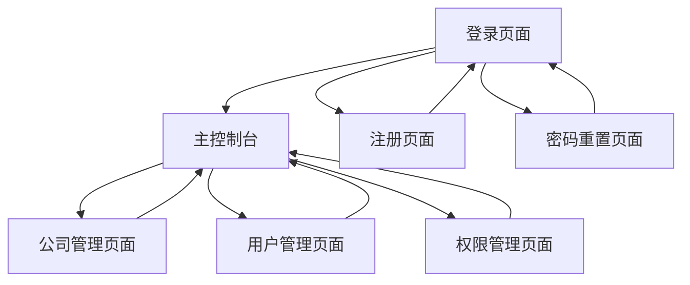

# 工装制造管理系统 - 产品需求文档

## 1. 产品概述

工装制造管理系统是一个面向制造企业的综合管理平台，旨在提供用户管理、公司管理和权限控制等核心功能。
系统通过角色权限管理实现不同岗位人员的差异化访问控制，提升企业管理效率和数据安全性。
目标是为制造企业提供一个安全、高效、易用的数字化管理解决方案。

## 2. 核心功能

### 2.1 用户角色

| 角色    | 注册方式                       | 核心权限                     |
| ----- | -------------------------- | ------------------------ |
| 超级管理员 | 账号：18004499801   密码：123456 | 拥有所有模块的完整访问权限，可管理所有用户和公司 |
| 生产经理  | 手机号注册，管理员审核                | 可访问生产相关模块，管理下属用户         |
| 财务    | 手机号注册，管理员审核                | 可访问财务相关模块和报表             |
| 段长    | 手机号注册，管理员审核                | 可管理本部门员工和生产任务            |
| 技术员   | 手机号注册，管理员审核                | 可访问技术文档和工艺管理模块           |
| 库管员   | 手机号注册，管理员审核                | 可访问库存管理和物料管理模块           |
| 员工    | 手机号注册，管理员审核                | 基础功能访问权限                 |

 

 

### 2.2 功能模块

我们的工装制造管理系统包含以下主要页面：

1. **登录页面**：用户身份验证、密码重置入口
2. **注册页面**：新用户注册、信息填写验证
3. **主控制台**：系统概览、快捷操作、通知中心
4. **公司管理页面**：公司信息维护、组织架构管理
5. **用户管理页面**：用户账户管理、角色分配
6. **权限管理页面**：角色定义、权限配置、模块访问控制

### 2.3 页面详情

| 页面名称   | 模块名称 | 功能描述                                                   |
| ------ | ---- | ------------------------------------------------------ |
| 登录页面   | 用户认证 | 手机号密码登录验证，记住登录状态，跳转到重置密码                               |
| 登录页面   | 密码重置 | 通过身份证号验证身份，重置登录密码                                      |
| 注册页面   | 用户注册 | 填写手机号、身份证号、真实姓名、所属公司、用户角色，设置密码并确认                      |
| 注册页面   | 信息验证 | 验证手机号唯一性、身份证号格式、密码一致性检查                                |
| 主控制台   | 模块   | 根据用户角色显示可访问的功能模块                                       |
| 主控制台   | 系统概览 | 显示用户信息、公司信息、系统通知                                       |
| 公司管理页面 | 公司列表 | 显示所有公司信息，支持搜索和筛选，预设分公司：工具工装 科技工装 冲压工装                  |
| 公司管理页面 | 公司操作 | 新增公司、编辑公司信息、删除公司（需确认）                                  |
| 用户管理页面 | 用户列表 | 显示用户信息、所属公司、角色状态                                       |
| 用户管理页面 | 用户操作 | 创建用户、编辑用户信息、禁用/启用用户、角色分配。新注册用户默认为禁用状态。                 |
| 权限管理页面 | 角色管理 | 创建角色、编辑角色名称、删除角色、修改角色，预设角色：超级管理员、生产经理、财务、段长、技术员、库管员、员工 |
| 权限管理页面 | 权限配置 | 为角色分配可访问的功能模块，设置操作权限                                   |

## 3. 核心流程

### 用户注册流程

1. 用户访问注册页面
2. 填写个人信息（手机号、身份证号、真实姓名）
3. 选择所属公司和申请角色
4. 设置登录密码并确认
5. 提交注册申请
6. 超级管理员审核通过后账户激活

### 用户登录流程

1. 用户输入手机号和密码
2. 系统验证用户身份
3. 登录成功后跳转到主控制台
4. 根据用户角色显示可访问的功能模块

### 超级管理员操作流程

1. 超级管理员登录系统
2. 访问公司管理模块，维护公司信息
3. 访问用户管理模块，审核新用户申请
4. 访问权限管理模块，配置角色权限
5. 为用户分配合适的角色

## 4. 用户界面设计

### 4.1 设计风格

* **主色调**：蓝色系（#1890FF 主蓝色，#40A9FF 浅蓝色）

* **辅助色**：白色（#FFFFFF）、浅灰色（#F5F5F5）

* **按钮样式**：圆角矩形，蓝色背景，白色文字，悬停时颜色加深

* **字体**：微软雅黑，标题16-20px，正文14px，说明文字12px

* **布局风格**：卡片式布局，顶部导航栏，左侧菜单栏

* **图标风格**：线性图标，蓝色主题，简洁现代

### 4.2 页面设计概览

| 页面名称   | 模块名称 | UI元素                              |
| ------ | ---- | --------------------------------- |
| 登录页面   | 登录表单 | 居中卡片布局，蓝色渐变背景，白色表单卡片，圆角输入框，蓝色登录按钮 |
| 注册页面   | 注册表单 | 多步骤表单，进度指示器，分组输入字段，表单验证提示         |
| 主控制台   | 顶部导航 | 蓝色导航栏，白色文字，用户头像下拉菜单，系统Logo        |
| 主控制台   | 侧边菜单 | 白色背景，蓝色选中状态，图标+文字组合，可折叠设计         |
| 公司管理页面 | 数据表格 | 白色卡片容器，表格头部蓝色背景，行悬停效果，操作按钮组       |
| 用户管理页面 | 用户列表 | 头像+姓名显示，状态标签（绿色激活/灰色禁用），筛选器组件     |
| 权限管理页面 | 权限树  | 树形结构展示，复选框选择，层级缩进，展开/折叠图标         |

### 4.3 响应式设计

系统采用桌面优先的响应式设计，支持1920px、1366px、1024px等主流分辨率。
在平板设备上侧边菜单自动折叠，在手机设备上采用底部导航栏设计。
所有表单和数据表格都支持触摸操作优化。
