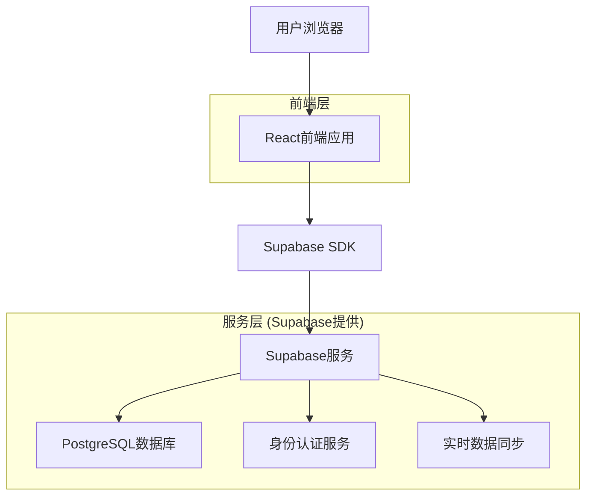
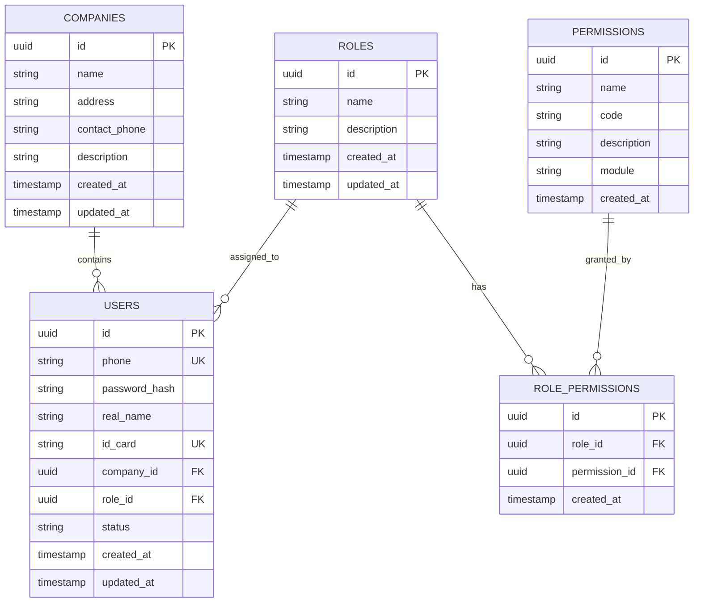

# 工装制造管理系统 - 技术架构文档

## 1. 架构设计



## 2. 技术描述

- **前端**: React@18 + TypeScript@5 + Vite@5 + Tailwind CSS@3 + Ant Design@5
- **后端**: Supabase (PostgreSQL + 身份认证 + 实时API)
- **状态管理**: Zustand
- **路由**: React Router@6
- **表单处理**: React Hook Form + Zod验证

## 3. 路由定义

| 路由 | 用途 |
|------|------|
| /login | 登录页面，用户身份验证 |
| /register | 注册页面，新用户注册 |
| /reset-password | 密码重置页面，通过身份证号重置密码 |
| /dashboard | 主控制台，系统概览和导航 |
| /companies | 公司管理页面，公司信息的增删改查 |
| /users | 用户管理页面，用户账户管理和角色分配 |
| /permissions | 权限管理页面，角色和权限配置 |
| /profile | 个人资料页面，用户信息修改 |

## 4. API定义

### 4.1 核心API

**用户认证相关**

```typescript
// 登录
POST /auth/v1/token
```

请求参数:
| 参数名 | 参数类型 | 是否必需 | 描述 |
|--------|----------|----------|------|
| phone | string | true | 用户手机号 |
| password | string | true | 登录密码 |

响应:
| 参数名 | 参数类型 | 描述 |
|--------|----------|------|
| access_token | string | 访问令牌 |
| refresh_token | string | 刷新令牌 |
| user | object | 用户信息 |

**用户管理相关**

```typescript
// 获取用户列表
GET /rest/v1/users
```

响应:
| 参数名 | 参数类型 | 描述 |
|--------|----------|------|
| id | uuid | 用户ID |
| phone | string | 手机号 |
| real_name | string | 真实姓名 |
| id_card | string | 身份证号 |
| company_id | uuid | 所属公司ID |
| role_id | uuid | 用户角色ID |
| status | string | 用户状态 |

**公司管理相关**

```typescript
// 创建公司
POST /rest/v1/companies
```

请求参数:
| 参数名 | 参数类型 | 是否必需 | 描述 |
|--------|----------|----------|------|
| name | string | true | 公司名称 |
| address | string | false | 公司地址 |
| contact_phone | string | false | 联系电话 |
| description | string | false | 公司描述 |

## 5. 数据模型

### 5.1 数据模型定义



### 5.2 数据定义语言

**公司表 (companies)**
```sql
-- 创建公司表
CREATE TABLE companies (
    id UUID PRIMARY KEY DEFAULT gen_random_uuid(),
    name VARCHAR(100) NOT NULL,
    address TEXT,
    contact_phone VARCHAR(20),
    description TEXT,
    created_at TIMESTAMP WITH TIME ZONE DEFAULT NOW(),
    updated_at TIMESTAMP WITH TIME ZONE DEFAULT NOW()
);

-- 创建索引
CREATE INDEX idx_companies_name ON companies(name);

-- 设置权限
GRANT SELECT ON companies TO anon;
GRANT ALL PRIVILEGES ON companies TO authenticated;
```

**用户表 (users)**
```sql
-- 创建用户表
CREATE TABLE users (
    id UUID PRIMARY KEY DEFAULT gen_random_uuid(),
    phone VARCHAR(11) UNIQUE NOT NULL,
    password_hash VARCHAR(255) NOT NULL,
    real_name VARCHAR(50) NOT NULL,
    id_card VARCHAR(18) UNIQUE NOT NULL,
    company_id UUID REFERENCES companies(id),
    role_id UUID REFERENCES roles(id),
    status VARCHAR(20) DEFAULT 'active' CHECK (status IN ('active', 'inactive', 'pending')),
    created_at TIMESTAMP WITH TIME ZONE DEFAULT NOW(),
    updated_at TIMESTAMP WITH TIME ZONE DEFAULT NOW()
);

-- 创建索引
CREATE INDEX idx_users_phone ON users(phone);
CREATE INDEX idx_users_id_card ON users(id_card);
CREATE INDEX idx_users_company_id ON users(company_id);
CREATE INDEX idx_users_role_id ON users(role_id);

-- 设置权限
GRANT SELECT ON users TO anon;
GRANT ALL PRIVILEGES ON users TO authenticated;
```

**角色表 (roles)**
```sql
-- 创建角色表
CREATE TABLE roles (
    id UUID PRIMARY KEY DEFAULT gen_random_uuid(),
    name VARCHAR(50) NOT NULL,
    description TEXT,
    created_at TIMESTAMP WITH TIME ZONE DEFAULT NOW(),
    updated_at TIMESTAMP WITH TIME ZONE DEFAULT NOW()
);

-- 创建索引
CREATE INDEX idx_roles_name ON roles(name);

-- 设置权限
GRANT SELECT ON roles TO anon;
GRANT ALL PRIVILEGES ON roles TO authenticated;

-- 初始化角色数据
INSERT INTO roles (name, description) VALUES
('超级管理员', '拥有系统所有权限'),
('生产经理', '负责生产管理相关功能'),
('财务', '负责财务管理相关功能'),
('段长', '负责部门管理相关功能'),
('技术员', '负责技术相关功能'),
('库管员', '负责库存管理相关功能'),
('员工', '基础员工权限');
```

**权限表 (permissions)**
```sql
-- 创建权限表
CREATE TABLE permissions (
    id UUID PRIMARY KEY DEFAULT gen_random_uuid(),
    name VARCHAR(50) NOT NULL,
    code VARCHAR(50) UNIQUE NOT NULL,
    description TEXT,
    module VARCHAR(30) NOT NULL,
    created_at TIMESTAMP WITH TIME ZONE DEFAULT NOW()
);

-- 创建索引
CREATE INDEX idx_permissions_code ON permissions(code);
CREATE INDEX idx_permissions_module ON permissions(module);

-- 设置权限
GRANT SELECT ON permissions TO anon;
GRANT ALL PRIVILEGES ON permissions TO authenticated;

-- 初始化权限数据
INSERT INTO permissions (name, code, description, module) VALUES
('查看公司', 'company:read', '查看公司信息', 'company'),
('创建公司', 'company:create', '创建新公司', 'company'),
('编辑公司', 'company:update', '编辑公司信息', 'company'),
('删除公司', 'company:delete', '删除公司', 'company'),
('查看用户', 'user:read', '查看用户信息', 'user'),
('创建用户', 'user:create', '创建新用户', 'user'),
('编辑用户', 'user:update', '编辑用户信息', 'user'),
('删除用户', 'user:delete', '删除用户', 'user'),
('查看权限', 'permission:read', '查看权限信息', 'permission'),
('编辑权限', 'permission:update', '编辑权限配置', 'permission');
```

**角色权限关联表 (role_permissions)**
```sql
-- 创建角色权限关联表
CREATE TABLE role_permissions (
    id UUID PRIMARY KEY DEFAULT gen_random_uuid(),
    role_id UUID REFERENCES roles(id) ON DELETE CASCADE,
    permission_id UUID REFERENCES permissions(id) ON DELETE CASCADE,
    created_at TIMESTAMP WITH TIME ZONE DEFAULT NOW(),
    UNIQUE(role_id, permission_id)
);

-- 创建索引
CREATE INDEX idx_role_permissions_role_id ON role_permissions(role_id);
CREATE INDEX idx_role_permissions_permission_id ON role_permissions(permission_id);

-- 设置权限
GRANT SELECT ON role_permissions TO anon;
GRANT ALL PRIVILEGES ON role_permissions TO authenticated;
```

**更新时间触发器**
```sql
-- 创建更新时间函数
CREATE OR REPLACE FUNCTION update_updated_at_column()
RETURNS TRIGGER AS $$
BEGIN
    NEW.updated_at = NOW();
    RETURN NEW;
END;
$$ language 'plpgsql';

-- 为相关表添加更新时间触发器
CREATE TRIGGER update_companies_updated_at BEFORE UPDATE ON companies
    FOR EACH ROW EXECUTE FUNCTION update_updated_at_column();

CREATE TRIGGER update_users_updated_at BEFORE UPDATE ON users
    FOR EACH ROW EXECUTE FUNCTION update_updated_at_column();

CREATE TRIGGER update_roles_updated_at BEFORE UPDATE ON roles
    FOR EACH ROW EXECUTE FUNCTION update_updated_at_column();
```